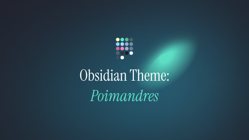

## Obsidian Poimandres Theme

**A port of the popular Poimandres code editor theme to Obsidian. Enjoy a familiar and beautiful dark theme for your knowledge base!**

## Features

-   **Dark theme:** Based on the Poimandres color scheme, this theme provides a comfortable and focused writing experience in low-light environments.
-   **Syntax highlighting:** Supports syntax highlighting for various programming languages and code snippets.
-   **Clear differentiation:** Leverages color to clearly differentiate between different elements in your notes, improving readability.
-   **Customizable:** While based on Poimandres, you can further customize colors within Obsidian's theme settings.

## Contributing

We welcome contributions to this theme! If you'd like to improve the theme or add features, feel free to fork the repository and submit a pull request.

## License

This theme is licensed under the MIT License. See the LICENSE file for details.
